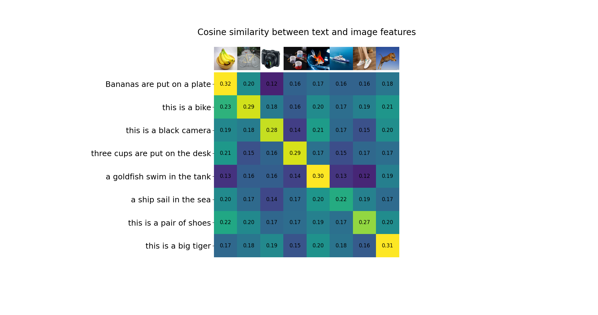
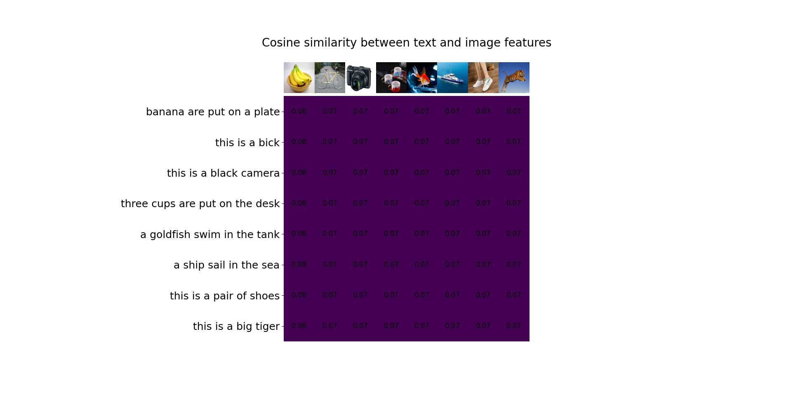
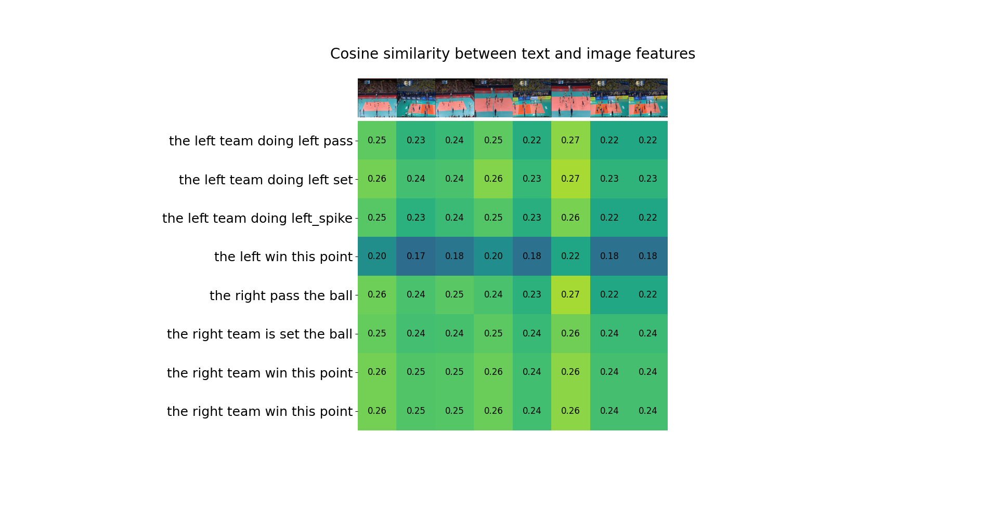
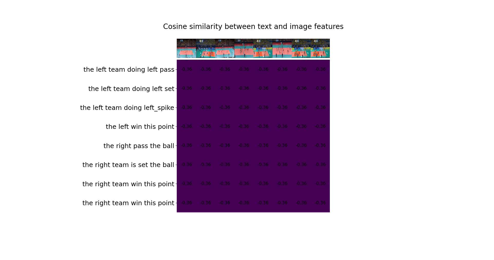

# 1.工作
将clip的预训练模型用volleyball数据集finetune,并在日常物品测试集上和排球比赛测试集上进行测试
# 2.训练
用不同的batch和数据进行了三组训练(volleyball数据集中一共有50多场比赛这里的比赛场数指选用了几场比赛)
1.  A:比赛场数=4  batchsize=64  epoch = 4
2.  B:比赛场数=4  batchsize=300 epoch = 8
3.  C:比赛场数=14 batchsize=300 epoch = 1

# 3.实验结果
##  i.日常物品测试集
1.  原本clip模型的cosine相似度
    可以看出来实验结果还是很好的，这组图片是网上随机找的，输入了描述性的语句可以明显看出对角线的相似度最高

1.  测试集A

1. 测试集C:

在训练完比赛的数据集之后，原本的语义空间也似乎丢失了

## 排球测试集
1.  原本clip模型的cosine相似度
感觉因为原本的clip模型没有关于排球比赛的语义空间，所以结果比较随机，还是可以理解的。

2. 测试集B:

3. 测试集C:

4. 测试集A:
实验结果都差不多就不放了